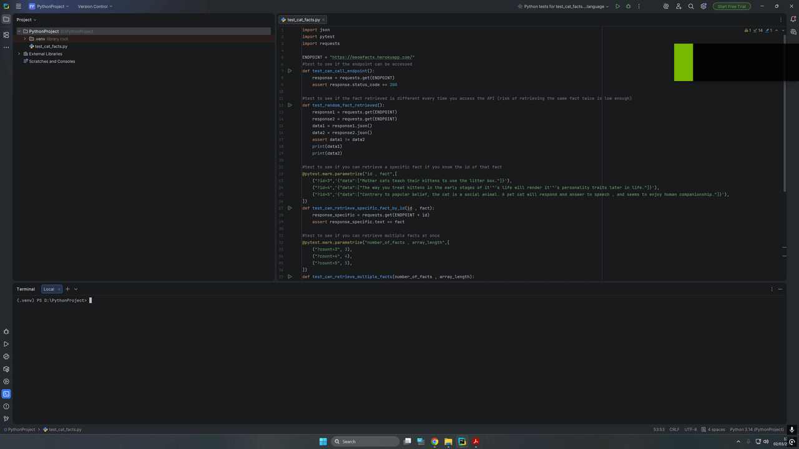

# Cat-facts-API-tests
Pytest framework for testing a Cat fact retrieving API

# Test cases contained in this project

Function name | What it tests for | Validation
--- | --- | ---
`test_can_call_endpoint` | check if the endpoint can be accessed | Make sure that the response code is equal to 200
`test_random_fact_retrieved` | check if the fact retrieved is different every time you access the API | Call the endpoint twice and compare the two responses to make sure they are different
`test_can_retrieve_specific_fact_by_id` | check if you can retrieve a specific fact by inputting it's ID | Call the endpoint with a stated id parameter of which we know the response. Compare the received response with the expected response to make sure they are identical
`test_can_retrieve_multiple_facts` | check if you can retrieve multiple facts with one API call | Call the endpoint with a stated count parameter. Transform the response into an array of strings and compare the array length to the given count integer to make sure they are identical
`test_can_retrieve_facts_by_language` | cehck if you can retrieve a specific fact localised in a supported language | Call the endpoint with a stated language and id parameter of which we know the response. Compare the received response with the expected response to make sure they are identical

# Test run locally

